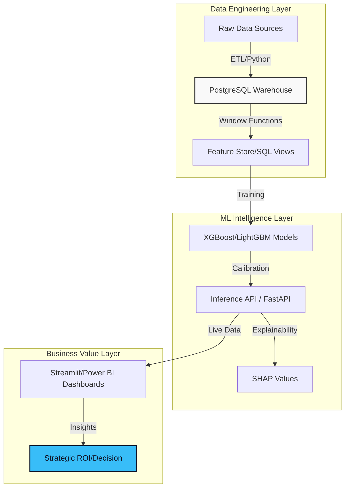

<!-- WORLD CLASS HEADER -->

 

<!-- NAVIGATION BAR -->
<table>
  <tr>
    <td align="center" width="20%"><a href="#executive-scorecard">🎯 Scorecard</a></td>
    <td align="center" width="20%"><a href="#technical-blueprint">🛠️ Blueprint</a></td>
    <td align="center" width="20%"><a href="#project-gallery">🏆 Portfolio</a></td>
    <td align="center" width="20%"><a href="#professional-journey">💼 Journey</a></td>
    <td align="center" width="20%"><a href="#lets-connect">🤝 Connect</a></td>
  </tr>
</table>

  
  
  

---

## 🎯 Executive Scorecard

| 🌍 Data Scale | 📈 ML Precision | 💰 Business ROI | 🏅 Certification |
| :---: | :---: | :---: | :---: |
|  |  |  |  |

I am a **Microsoft Certified Data Analyst Associate (PL-300)** with a track record of building end-to-end analytics solutions across **BFSI, E-commerce, and Supply Chain** domains. I specialize in converting raw datasets into executive-ready insights, KPI systems, and ML-driven risk models that drive measurable business outcomes.

---

## 🛠️ Technical Blueprint

### ⚙️ The Engineering Stack

`Infrastructure` $\rightarrow$     

`Intelligence` $\rightarrow$     

`Visualization` $\rightarrow$    

### 🧠 Core Engineering Competencies

- **Advanced Analytics:** RFM & Cohort Analysis, Hypothesis Testing, Statistical Modeling, Customer Segmentation.
- **Data Architecture:** Star Schema Design, ETL Pipelines, Data Modeling, Data Cleaning & Validation.
- **Machine Learning:** Cost-Sensitive Learning, Anomaly Detection, Feature Engineering, Predictive Analytics.

### 📐 System Architecture Workflow

---

## 🏆 Project Gallery

<table>
  <tr>
    <td width="50%" valign="top">
      <h3>🛡️ SentinelFlow: Fraud Platform</h3>
      
      

        <b>Scale:</b> 1M+ Transactions $\cdot$ 14 Fraud Typologies 
        <b>Key Win:</b> 0.941 AUC $\cdot$ \$2.14M Loss Prevented 
        <b>Tech:</b> <code>FastAPI</code>, <code>Postgres</code>, <code>Prometheus</code>, <code>XGBoost</code>
      

      <a href="https://github.com/rohit-bhowmick2002/Fraud-Detection-AML-Analytics-Platform"><b>Explore Repository $\rightarrow$</b></a>
    </td>
    <td width="50%" valign="top">
      <h3>🎵 KKBox: Churn Prediction</h3>
      
      

        <b>Scale:</b> 30M+ Records $\cdot$ 87 Engineered Features 
        <b>Key Win:</b> 0.8923 AUC $\cdot$ 5.1x Projected ROI 
        <b>Tech:</b> <code>LightGBM</code>, <code>SHAP</code>, <code>Pandas</code>, <code>Pytest</code>
      

      <a href="https://github.com/rohit-bhowmick2002/kkbox-churn-prediction"><b>Explore Repository $\rightarrow$</b></a>
    </td>
  </tr>
  <tr>
    <td width="50%" valign="top">
      <h3>📦 Olist: E-Comm Platform</h3>
      
      

        <b>Scale:</b> 1.5M+ Rows $\cdot$ 55 Production SQL Queries 
        <b>Key Win:</b> 0.894 AUC $\cdot$ R\$ 2.3M Annual Value 
        <b>Tech:</b> <code>SQLite</code>, <code>XGBoost</code>, <code>KMeans</code>, <code>Streamlit</code>
      

      <a href="https://github.com/rohit-bhowmick2002/Olist-E-Commerce-Analytics-ML-Platform"><b>Explore Repository $\rightarrow$</b></a>
    </td>
    <td width="50%" valign="top">
      <h3>📈 Retail Sales Forecasting</h3>
      
      

        <b>Scale:</b> 3M+ Transactions $\cdot$ 54 National Stores 
        <b>Key Win:</b> R² 0.78 $\cdot$ 42% Lift over Prophet 
        <b>Tech:</b> <code>XGBoost</code>, <code>Docker</code>, <code>Streamlit</code>, <code>Pandas</code>
      

      <a href="https://github.com/rohit-bhowmick2002/retail-sales-forecasting"><b>Explore Repository $\rightarrow$</b></a>
    </td>
  </tr>
</table>

---

## 📊 Engineering Impact Matrix

| Platform | Data Scale | Model | Core Metric | Business Outcome |
| :--- | :---: | :---: | :---: | :--- |
| **AML & Fraud** | $1\text{M}+$ | XGBoost | $0.94\text{ AUC}$ | **\$2.14M Loss Prevented** |
| **KKBox Churn** | $30\text{M}+$ | LightGBM | $0.89\text{ AUC}$ | **5.1x Projected ROI** |
| **Olist E-Comm** | $1.5\text{M}+$ | XGBoost | $0.89\text{ AUC}$ | **R\$ 2.3M Annual Value** |
| **Retail Forecast**| $3\text{M}+$ | XGBoost | $\text{R}^2=0.78$ | **42% Performance Lift** |

---

## Professional Journey

<b>🔍 Click to expand Experience & Education</b>

### Data Analyst (Virtual) — Quantium, TCS, Deloitte
**2026**
- **Quantium:** Identified product-performance gaps across 4+ sales categories using SQL/Python EDA, informing 3 pricing strategy adjustments.
- **TCS:** Designed 2 executive-level Power BI dashboards with 30+ DAX measures; reduced manual reporting effort by **60%**.
- **Deloitte:** Validated 500+ records to identify root-cause data quality issues, reducing stakeholder review time by **30%**.

### B.Tech in Computer Science Engineering
**Seacom Engineering College, West Bengal** | **CGPA: 7.7/10** | *2021 – 2025*
- Core Focus: DBMS, Statistical Modeling, Machine Learning, Data Structures & Algorithms.

---

## 📜 Certifications

| Certification | Issuer | Year |
|---|---|---:|
| **Microsoft Certified: Data Analyst Associate (PL-300)** | Microsoft | 2026 |
| **Google AI Essentials** | Google | 2026 |
| **Google Prompting Essentials** | Google | 2026 |
| **Microsoft Azure AI Essentials** | LinkedIn / Microsoft | 2025 |

---

## GitHub Analytics

  
  
   
  

---

## Lets Connect

I am seeking opportunities as an **Analytics Engineer**, **BI Architect**, or **ML Engineer** where I can build systems that translate massive datasets into strategic growth.

 

  

