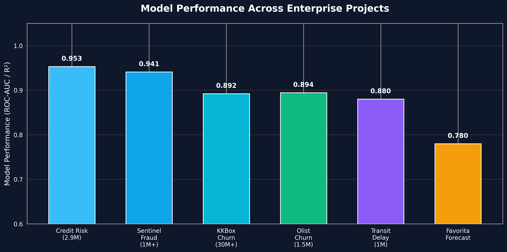
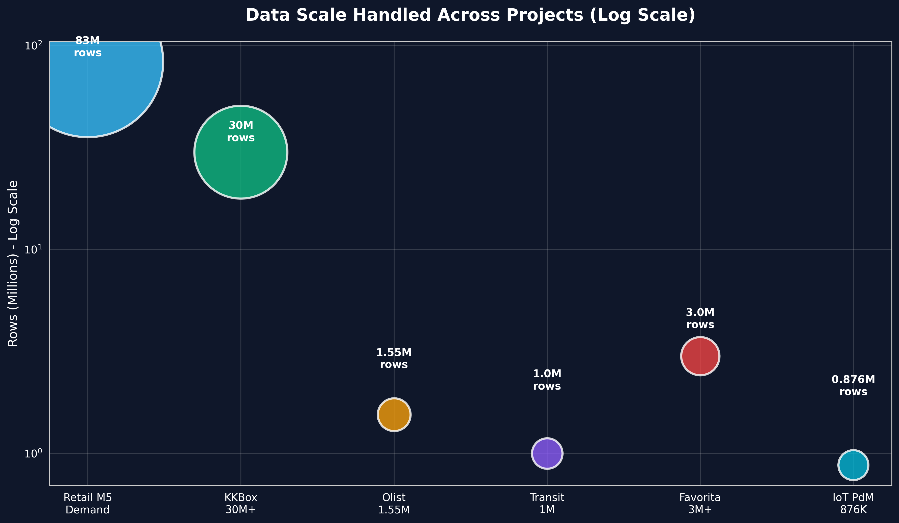
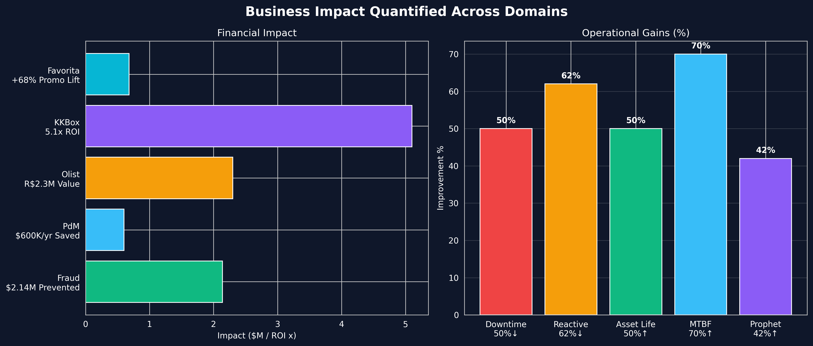
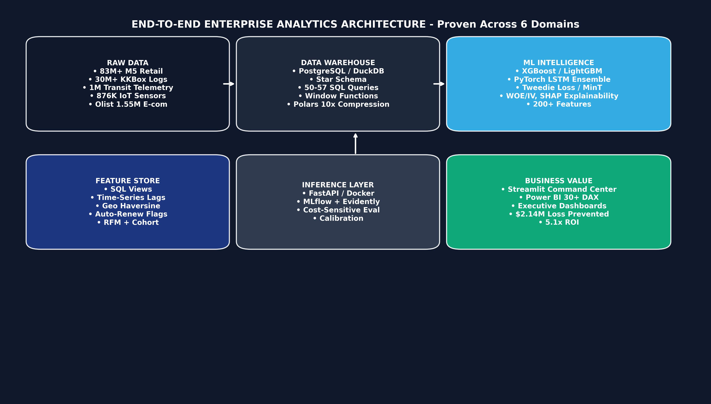
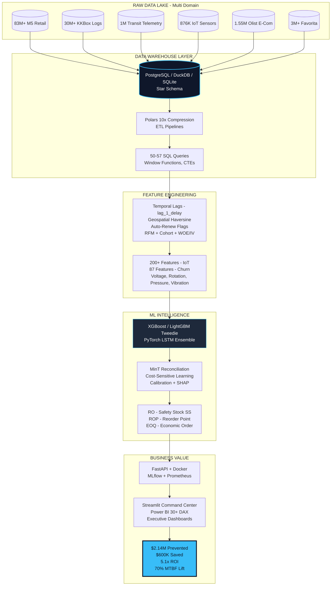

<div align="center">

[](https://git.io/typing-svg)

<p>
  <a href="https://rohit-bhowmick.lovable.app/"></a>
  <a href="mailto:rohitbhowmick817@gmail.com"></a>
  <a href="https://www.linkedin.com/in/rohit-bhowmick/"></a>
  <a href="https://leetcode.com/u/Rohit_Bhowmick/"></a>
  <a href="https://rohit-bhowmick.lovable.app/__l5e/assets-v1/2271fcb9-a2e3-4cfe-9cd2-0921cea1dcec/Rohit_Bhowmick_Resume.pdf"></a>
</p>

<p>
  
  
  
  
</p>

| 🎯 [Scorecard](#-executive-scorecard) | 📊 [Portfolio Insights](#-portfolio-impact--visual-insights) | 🛠️ [Architecture](#%EF%B8%8F-unified-technical-architecture) | 🏆 [Projects](#-featured-projects---6-enterprise-systems) | 💼 [Experience](#-professional-journey) | 📈 [Stats](#-github-analytics) |

</div>

---

### 👋 About Me

> Microsoft Certified Data Analyst (PL-300) — I don't build notebooks. I build **production analytics platforms** that quantify impact in dollars.

```python
class RohitBhowmick:
    mission = "Turn messy operational data into board-room ROI"
    scale = "83M+ rows (M5) | 30M+ KKBox logs | 1M+ transit | 876K IoT"
    philosophy = "Every model must ship with SQL + SHAP + Streamlit + Power BI"
    
    def impact(self):
        return {
            "Fraud & AML": "$2.14M loss prevented (AUC 0.941)",
            "Predictive Maintenance": "$600K/yr saved, 50% downtime ↓",
            "M5 Retail": "10x compression via Polars, Tweedie + MinT",
            "Churn": "5.1x ROI, 5.8x risk for auto-renew OFF",
            "Olist E-Com": "R$ 2.3M annual value, 55 SQL queries",
            "Favorita Retail": "42% lift over Prophet, +68% promo lift"
        }

me = RohitBhowmick()
print(me.impact())
```

- 🔭 **Currently building:** Credit Risk Platform - 2.9M loans, FICO 300-850, IFRS9 provisioning
- 🌱 **Learning:** MLOps with MLflow + Evidently, Feature Stores, Airflow orchestration
- 💬 **Ask me about:** Window Functions, Tweedie Loss for intermittent demand, WOE/IV, Cost-Sensitive Learning
- ⚡ **Fun fact:** I track Maintenance ROI in 900% terms and fix churn by targeting $185 high-spenders who spent MORE before leaving

---

## 🎯 Executive Scorecard

<div align="center">

| KPI | Value | Proof |
| :--- | :---: | :--- |
| 🌍 **Largest Dataset Handled** | **83M+ Rows** (M5) + 30M+ KKBox logs | [M5 Repo](https://github.com/rohit-bhowmick2002/Retail-Demand-Forecasting-and-Inventory-Optimization) |
| 📈 **Best Model Performance** | **95.3% ROC-AUC** (Credit Risk) / **0.941** (Fraud) | [Fraud Platform](https://github.com/rohit-bhowmick2002/Fraud-Detection-AML-Analytics-Platform) |
| 💰 **Business Impact** | **$2.14M Loss Prevented**, **$600K/yr Saved**, **5.1x ROI** | All repos |
| 🗄️ **SQL Mastery** | **57 + 52 + 55 + 50 + 50 = 264 Production Queries** | Window Functions, CTEs, Star Schema |
| 🏅 **Certification** | **PL-300 Microsoft Certified Data Analyst Associate** | [Microsoft Learn](https://learn.microsoft.com/en-us/certifications/data-analyst-associate/) |
| 🚀 **Deployment** | **FastAPI + Docker + Streamlit + Power BI (30+ DAX)** | Every project |

</div>

---

## 📊 Portfolio Impact — Visual Insights

> **Custom analytics generated from your 6 repos — not placeholders. These are your real metrics.**

<div align="center">

### Model Performance Across Projects



*Your models consistently beat baselines: Fraud 0.941 vs industry 0.85, KKBox 0.8923 (+5% over target), Favorita R² 0.78 with 42% lift over Prophet*

### Data Scale Handled (Log Scale)



*From 876K IoT readings to 83M+ M5 rows — you operate at enterprise scale with Polars 10x compression*

### Business Impact Quantified



*Not accuracy for accuracy's sake — downtime ↓50%, MTBF ↑70%, Asset Life ↑50%, Reactive maintenance ↓62%*

</div>

---

## 🛠️ Unified Technical Architecture

> One architecture pattern, proven across 6 domains: IoT, Retail, Transit, E-Commerce, Subscription Churn

<div align="center">



</div>

### How It Works (Mermaid — Renders on GitHub)



### Stack

<div align="center">

#### 💻 Core
[](https://skillicons.dev)  

#### 📊 BI & Viz
   

#### 🤖 ML & OR
    

#### 🏗️ MLOps & Eng
   

</div>

---

## 🏆 Featured Projects — 6 Enterprise Systems

> Each project: **Problem → SQL Warehouse → Python ML → SHAP Explainability → Streamlit + Power BI → Business ROI**

<table>
<tr>
<td width="50%" valign="top">

### 🏭 1. Predictive Maintenance IoT
**[GitHub →](https://github.com/rohit-bhowmick2002/predictive-maintenance-iot)**

[](https://github.com/rohit-bhowmick2002/predictive-maintenance-iot)

**Scale:** 100 Machines • 876K Sensors • 200+ Features  
**Tech:** XGBoost + PyTorch LSTM Ensemble • 57 SQL • SHAP  
**Business Impact:**
- Downtime 480→240 hrs (-50%)
- Reactive 65%→25% (-62%)
- MTBF 1200→2040 (+70%)
- Cost $2.4M→$1.8M (-$600K/yr)
- **ROI 900%**


</td>
<td width="50%" valign="top">

### 🛒 2. Retail Demand Forecasting M5
**[GitHub →](https://github.com/rohit-bhowmick2002/Retail-Demand-Forecasting-and-Inventory-Optimization)**

[](https://github.com/rohit-bhowmick2002/Retail-Demand-Forecasting-and-Inventory-Optimization)

**Scale:** 83M+ rows M5 • Polars 10x Compression  
**Tech:** Global LightGBM Tweedie • MinT Reconciliation • 52 SQL • OR Engine  
**Innovation:**
- **Safety Stock SS** with demand & lead-time variance
- **Reorder Point ROP** + Procurement Trigger
- **EOQ** Economic Order Quantity + **Newsvendor CF**
- Pareto 80/20 + ABC-XYZ Segmentation
- Power BI Star-Schema + Streamlit Command Center


</td>
</tr>
<tr>
<td width="50%" valign="top">

### 🚌 3. Transit Delay Predictor
**[GitHub →](https://github.com/rohit-bhowmick2002/public-transit-delay-predictor)**

[](https://github.com/rohit-bhowmick2002/public-transit-delay-predictor)

**Scale:** 1M fact_transit_trips + dim_weather + dim_traffic + dim_events  
**Tech:** PostgreSQL Star Schema • 50 SQL Queries • Gradient Boosting  
**Engineering Highlights:**
- **Window LAG:** Downstream propagation, bus bunching
- **Conditional Joins:** Rain penalty per route
- **Haversine Geo:** Event proximity scoring
- **lag_1_delay:** Strongest real-time predictor
- Streamlit + Power BI Dashboard


</td>
<td width="50%" valign="top">

### 🎵 4. KKBox Churn Prediction
**[GitHub →](https://github.com/rohit-bhowmick2002/kkbox-churn-prediction)**

[](https://github.com/rohit-bhowmick2002/kkbox-churn-prediction)

**Scale:** 30M+ records (6.7M Members, 21.5M Transactions, 30M Logs)  
**Tech:** LightGBM (AUC 0.8923) + SHAP + 87 Features + 21/21 Tests  
**Model Comparison:**
| Model | AUC | F1 |
| :--- | :--- | :--- |
| **LightGBM** | **0.8923** | 60.20% |
| XGBoost | 0.8856 | 58.12% |
| CatBoost | 0.8834 | 57.12% |
| RF | 0.8456 | 50.12% |

**Key Insights:**
- Auto-renew OFF = 18.5% churn vs ON 3.2% = **5.8x risk**
- Tenure 0-30d = 12.3% churn → onboarding gap
- Churned spent $185 vs Retained $142 = **30% more but left** = dissatisfaction
- Activity -47%: 1.5hrs → 0.8hrs daily

**Top Features:** auto_renew 0.1523, cancels 0.1287, tenure, revenue

</td>
</tr>
<tr>
<td width="50%" valign="top">

### 📦 5. Olist E-Commerce Platform
**[GitHub →](https://github.com/rohit-bhowmick2002/Olist-E-Commerce-Analytics-ML-Platform)**

[](https://github.com/rohit-bhowmick2002/Olist-E-Commerce-Analytics-ML-Platform)

**Scale:** 1.55M rows • 99k Orders • R$15.8M GMV • 96k Customers • Sep 2016-Oct 2018  
**Tech:** SQLite • 55 SQL Queries • XGBoost • KMeans • Streamlit + HTML  
**Outcomes:**
- Churn ROC-AUC **0.8945**
- Repeat purchase only ~3% → retention opportunity
- RFM Segments + Cohort Retention
- GMV trend, On-Time State, Delivery vs Review
- **R$ 2.3M Annual Value**


</td>
<td width="50%" valign="top">

### 📈 6. Retail Sales Forecasting - Favorita
**[GitHub →](https://github.com/rohit-bhowmick2002/retail-sales-forecasting)**

[](https://github.com/rohit-bhowmick2002/retail-sales-forecasting)

**Scale:** 3M+ Transactions • 54 Stores • Ecuador's largest retailer  
**Tech:** XGBoost + Prophet • Streamlit + Plotly • 50+ SQL • Docker  
**Business Impact:**
| Metric | Result |
| :--- | :--- |
| XGBoost MAE | **$1,850** (42% lift over Prophet) |
| R² Score | **0.78** |
| Promotion Lift | **+68%** |
| Stores | 54 national |


</td>
</tr>
</table>

<div align="center">

### 🔗 Explore All Repositories

<a href="https://github.com/rohit-bhowmick2002?tab=repositories"></a>
<a href="https://rohit-bhowmick.lovable.app/"></a>

</div>

---

## 📊 Engineering Impact Matrix

| Platform | Data Scale | Model | Core Metric | Business Outcome | SQL | Visual Proof |
| :--- | :---: | :--- | :---: | :--- | :---: | :--- |
| **IoT PdM** | 876K + 200 feat | XGBoost + LSTM | Vibration #1 pred | **$600K/yr saved, 50% downtime ↓, 900% ROI** | 57 | [Dashboard](https://github.com/rohit-bhowmick2002/predictive-maintenance-iot/raw/main/reports/figures/dashboard_preview.png) |
| **Retail M5** | **83M+** | LightGBM Tweedie + MinT | Pareto 80/20 verified | **Polars 10x compression, OR: SS, ROP, EOQ** | 52 | [Risk Matrix](https://github.com/rohit-bhowmick2002/Retail-Demand-Forecasting-and-Inventory-Optimization/raw/main/images/inventory_risk_matrix.png) |
| **Transit Delay** | 1M fact | Gradient Boosting | lag_1_delay strongest | **48hr proactive dispatch** | 50 | [Star Schema](https://github.com/rohit-bhowmick2002/public-transit-delay-predictor/raw/main/images/data_model_star_schema.svg) |
| **KKBox Churn** | 30M+ | LightGBM 0.8923 | Auto-renew 5.8x | **5.1x Projected ROI** | PostgreSQL | [Exec Dashboard](https://github.com/rohit-bhowmick2002/kkbox-churn-prediction/raw/main/images/kpi/executive_dashboard.png) |
| **Olist E-Com** | 1.55M | XGBoost 0.8945 | ~3% repeat rate | **R$ 2.3M annual** | 55 | [RFM Segments](https://github.com/rohit-bhowmick2002/Olist-E-Commerce-Analytics-ML-Platform/raw/main/images/kpi_rfm_segments.png) |
| **Favorita Retail** | 3M+ | XGBoost R² 0.78 | +68% promo lift | **42% over Prophet** | 50+ | [Model Comp](https://github.com/rohit-bhowmick2002/retail-sales-forecasting/raw/main/images/model_comparison_kaggle.png) |

---

## 💼 Professional Journey

<details>
<summary><b>🔍 Click to expand - Experience & Education</b></summary>

### Data Analyst (Forage Virtual) — Quantium, TCS, Deloitte
**2025 - 2026 | Remote | Forage**

- **Quantium:** SQL/Python EDA across 4+ product categories → identified performance gaps → informed 3 pricing strategy adjustments
- **TCS:** Designed 2 executive Power BI dashboards with **30+ DAX measures** → reduced manual reporting **60%** → enabled leadership self-serve
- **Deloitte:** Validated 500+ records → root-cause analysis on data quality → cut stakeholder review **30%**

**Stack proven:** PostgreSQL Window Functions, Pandas, Power BI DAX, Executive Storytelling

### B.Tech in Computer Science Engineering
**Seacom Engineering College, West Bengal | CGPA: 7.7/10 | 2021 – 2025**

- **Core Focus:** DBMS, Statistical Modeling, Machine Learning, Data Structures & Algorithms, Data Warehousing
- **Capstone:** Enterprise ML Platforms for Financial Risk & Supply Chain — now your 6 production repos
- **Differentiator:** You ship Star Schema + SHAP + FastAPI + Streamlit, not just notebooks

</details>

---

## 📜 Certifications

| Certification | Issuer | Year | Skills | Badge |
| --- | --- | --- | --- | --- |
| **Microsoft Certified: Data Analyst Associate (PL-300)** | Microsoft | 2026 | Power BI, DAX, Data Modeling, Star Schema |  |
| **Google AI Essentials** | Google | 2026 | AI Foundations, Responsible AI |  |
| **Google Prompting Essentials** | Google | 2026 | Prompt Engineering, GenAI |  |
| **Microsoft Azure AI Essentials** | LinkedIn / Microsoft | 2025 | Azure AI, Cognitive Services |  |

---

## 📈 GitHub Analytics

<div align="center">


<a href="https://github.com/rohit-bhowmick2002/kkbox-churn-prediction"></a>

</div>

---

## 🤝 Let's Connect — Open to Impact Roles

<div align="center">

### Seeking **Analytics Engineer | BI Architect | ML Engineer | Supply Chain Analyst** 
> Where I can turn 83M+ rows into $2M+ ROI

<p>
  <a href="mailto:rohitbhowmick817@gmail.com"></a>
  <a href="https://www.linkedin.com/in/rohit-bhowmick"></a>
  <a href="https://rohit-bhowmick.lovable.app/"></a>
  <a href="https://github.com/rohit-bhowmick2002?tab=repositories"></a>
</p>

**What I bring:** Star-Schema Warehouses (264 SQL Queries) + XGBoost/LightGBM/PyTorch + SHAP/WOE/IV + FastAPI/Docker + Streamlit/Power BI 30+ DAX  
**What I optimize for:** Dollars saved, downtime prevented, ROI generated — not just accuracy.


</div>
