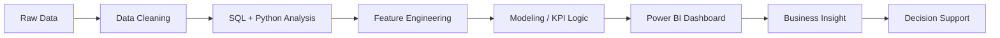

<!-- Premium Header -->

  
  
  
  

---

## 👋 About Me

I am a **Microsoft Certified Data Analyst Associate (PL-300)** with hands-on analytics experience across **BFSI, e-commerce, and supply chain domains**. I specialize in building scalable analytics solutions using **SQL, Python, Power BI, DAX, and Scikit-learn** — transforming raw datasets into clear business narratives, KPI dashboards, ML-driven risk models, and executive-ready insights.

My work focuses on:

- 📊 Designing **Power BI dashboards** with advanced DAX measures and stakeholder-ready KPI storytelling  
- 🧠 Building **machine learning pipelines** for fraud detection, risk scoring, and predictive analytics  
- 🧹 Creating clean, repeatable **ETL and data modeling workflows** using SQL, Python, Pandas, and DuckDB  
- 🎯 Translating analytical findings into measurable business outcomes and decision support systems  

---

## 🏆 Impact Highlights

| Area | Measurable Outcome |
|---|---:|
| **Fraud Analytics** | Scored **230K+ banking transactions** with **100% fraud recall** on hold-out testing |
| **Supply Chain Risk** | Quantified **$479M** in disruption-driven risk exposure |
| **Inventory Analytics** | Identified **17 understocked SKUs**, including **9 critical** SKUs |
| **Delivery Analytics** | Built late-delivery prediction across **99K+ e-commerce orders** |
| **Dashboarding** | Developed Power BI dashboards with **30+ DAX measures** |
| **Reporting Automation** | Reduced manual reporting effort by an estimated **60%** in analyst simulations |

---

## 🛠️ Technical Toolkit

### Languages & Databases

### BI, Analytics & Visualization

### Python Data Stack & ML

### Tools & Platforms

---

## 🚀 Featured Analytics Projects

<table>
<tr>
<td width="50%" valign="top">

### 🛡️ AML & Financial Fraud Detection Analytics

**Tech:** SQL · Python · Power BI · Scikit-learn  
**Repository:** [Synthetic Financial Dataset for Fraud Detection](https://github.com/rohit-bhowmick2002/Synthetic-Financial-Dataset-for-Fraud-Detection)

- Engineered an end-to-end fraud detection pipeline for **230,000+ banking transactions**.
- Combined **Isolation Forest anomaly detection** with a **Random Forest classifier**.
- Achieved **100% fraud recall** on a stratified hold-out test set.
- Built Power BI risk dashboards with **4-tier KPI alerting** for analyst escalation.
- Optimized thresholds using a cost-based false-alarm vs missed-fraud model.

</td>
<td width="50%" valign="top">

### 📦 Supply Chain Risk Analytics

**Tech:** SQL · Python · Power BI · Excel  
**Repository:** [Supply Chain Risk Analytics](https://github.com/rohit-bhowmick2002/SUPPLY-CHAIN-RISK-ANALYTICS)

- Analyzed **3,000 purchase orders** across **120 suppliers** using DuckDB SQL and Pandas.
- Identified **17 understocked SKUs**, including **9 critical** inventory risks.
- Built a supplier risk watchlist and measured **28% late-delivery rate** across disruptions.
- Designed Power BI dashboards with **30+ DAX measures**.
- Quantified **$479M** in disruption-driven losses and automated reporting outputs.

</td>
</tr>
<tr>
<td width="50%" valign="top">

### 🛒 E-Commerce Delivery & Customer Analytics

**Tech:** SQL · Python · Power BI · Excel  
**Repository:** [E-commerce Olist Dataset](https://github.com/rohit-bhowmick2002/E-commerce_olist_dataset)

- Built a late-delivery risk model across **99,000+ e-commerce orders**.
- Engineered multi-table features from payments, fulfillment, geography, and customer behavior.
- Achieved **ROC-AUC of 0.733** for delivery risk prediction.
- Connected delivery patterns with review scores, freight burden, and order complexity.
- Delivered KPI tables and precision-recall tuned alert thresholds for exception monitoring.

</td>
<td width="50%" valign="top">

### 🌐 Portfolio & Additional Case Studies

**Repository:** [Rohit Bhowmick Portfolio](https://github.com/rohit-bhowmick2002/rohit-bhowmick-portfolio)

Additional repositories include analytics projects across:

- Retail sales analysis  
- Credit card churn analytics  
- Tax analytics  
- Zomato delivery analytics  
- OLA analysis  
- IPL dataset exploration  
- COVID-19 analysis  

</td>
</tr>
</table>

---

## 💼 Professional Experience

### Data Analyst — Quantium Virtual Analyst Program via Forage  
**Jun 2026 · Remote · Certificate**

- Applied SQL and Python EDA to large-scale retail transaction data to identify product-performance gaps across **4+ sales categories**.
- Delivered commercial analytics and customer segmentation reports supporting **3 pricing strategy adjustments**.

### Data Visualization Analyst — Tata Consultancy Services Virtual Analyst Program via Forage  
**May 2026 · Remote · Certificate**

- Designed **2 executive-level Power BI dashboards** using DAX for C-suite KPI communication.
- Automated **3+ insight-driven reports** in Power Query, reducing manual reporting effort by an estimated **60%**.

### Data Analyst — Deloitte Virtual Analyst Program via Forage  
**Mar 2026 · Remote · Certificate**

- Validated **500+ records** across SQL and Excel to identify root-cause data quality issues.
- Produced a structured analysis report with **5+ prioritized recommendations**, reducing stakeholder review time by **30%**.

### Front-End Development Intern — IBM SkillsBuild & CSRBOX Foundation  
**Jun 2023 – Jul 2023 · Remote · Certificate**

- Built and optimized responsive web interfaces using HTML, CSS, and JavaScript.
- Applied UI/UX principles and analytical debugging workflows within IBM’s industry-aligned curriculum.

---

## 🎓 Education

**B.Tech in Computer Science Engineering**  
Seacom Engineering College, Howrah, West Bengal  
**CGPA:** 7.7 / 10 · **Aug 2021 – Jun 2025**

**Relevant Coursework:** Database Management Systems, Statistical Modeling, Machine Learning, Data Structures & Algorithms

---

## 📜 Certifications

| Certification | Issuer | Year |
|---|---|---:|
| **Microsoft Certified: Data Analyst Associate (PL-300)** | Microsoft | 2026 |
| **Google AI Essentials** | Google | 2026 |
| **Google Prompting Essentials** | Google | 2026 |
| **Microsoft Azure AI Essentials** | LinkedIn Learning / Microsoft | 2025 |

---

## 📈 GitHub Analytics

 

---

## 🧭 Analytics Workflow

---

## 🤝 Let's Connect

I am actively interested in **Data Analyst**, **Business Intelligence Analyst**, and **Analytics Engineer** opportunities where I can build impactful dashboards, automate reporting workflows, and solve business problems with data.

 

 

